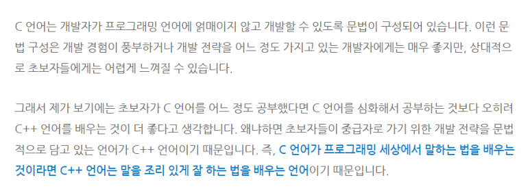

## C++를 공부하는 이유

얼마 전 수업에서 누군가 나에게 왜 c++를 공부하는지 물어봤다. 질문을 듣고 나도 선뜻 대답하지 못하고 좀 고민하였다. 그 순간 나 스스로도 만족스러운 대답을 하지는 못했던 것 같다. 

우선 가장 큰 이유는 그냥 재밌어서이다.

혼자 Do it C언어 입문을 공부하면서 코드가 내부적으로 어떤 식으로 동작하는지 전보다 많이 이해하게 되었고 그 과정이 신기했고, 포인터를 쓴다는 것이나 c언어의 문법 같은 것들이 좀 더 멋있고 엄밀해보였다. 

그 다음에 어떤 것들을 배워야할지 진로와 엮어서도 많이 고민을 해보았다. 그러다가 아래의 글을 읽었다.

https://blog.naver.com/tipsware/221028559903

C언어가 능숙하지는 않았고, 많이 구현해보지도 못했지만 C++를 공부하고 싶어졌다. 그래서 김성엽님의 블로그 글을 보면서 C++의 기본 개념들을 학습해보았다. 역시나 재밌었다. 그리고 C++가 어디에서 많이 쓰이는지 찾아봤다. 컴퓨터 그래픽스, 퍼포먼스가 필요한 분야, 딥러닝에서의 병렬 프로그래밍 등에 사용이 되었다. 내가 프로그래밍에 관심을 갖게된 계기도 HFT에서의 high perfomance, 병렬 프로그래밍 등 속도, 병렬화(경제학으로 따지면 분업으로 느껴졌다랄까)에 그 이유가 있었기 때문에 자연스럽게 C++를 더 공부하고 싶어졌던 것 같다. 내가 시각적 민감성이 아주 젬병이라는 것을 깨달아서 그래픽스에 대한 관심이 줄었으나, C++를 공부할 때 홍정모 교수님의 유튜브나 코드없는프로그래밍 채널을 많이 보게 되었다. 

## C++의 활용

솔직히 아직도 진로를 구체화하지는 못했다. 내가 실력을 쌓으면 자연히 어떤 길이 보이지 않을까 싶다. 내가 현재 쌓고 싶은 능력은 C++를 통한 구현력, 알고리즘 풀이(문제해결력, 코드 최적화), GPGPU이다. 당분간 싸피 수업에서 python을 통해 알고리즘 공부를 하겠지만 수업이 끝나고 C++로 풀이해보려고 한다. 올해 코딩테스트 응시를 C++로 할 생각이기 때문이다. 그러기 위해서는 C++ 언어 자체에 대한 이해가 필요했다.

## C++ 공부 계획

블로그에 몇 번 올렸던 것과 같이 요즘 코드없는프로그래밍을 통해 C++를 공부중이다. 강의의 50퍼? 정도 이해하고 있다. 강의 내용이 너무 좋은데 아직 나의 그릇을 넓히지 못한 탓인지 모든 내용이 다 담기지가 않는다. 그리고 들은 내용을 내가 직접 구현하면서 익혀봐야하는데 그것을 어떤 식으로 하는게 좋을까 고민해보았다. 그래서 당분간의 계획은 

1. 코드없는프로그래밍 강의 + 'a tour of C++ / 비야네 스트로스트롭 저' 책을 보면서 C++ 언어의 대한 이해와 코드가 돌아가는 내부 과정, 컴퓨터 구조, STL 등에 대해서 공부할 생각이다. a tour of C++는 어제 살까말까 30번은 고민한 것 같다. yes24에서 번역에 대해 신랄하게 비판하고 있는 댓글을 보고 망설이기도 했는데 일단 빠르게 훑어보는 것이 1차적 목적이고 예제를 좀 풀어보고 싶어서 책을 구입하였다.

2. 이렇게 C++ 언어에 대해 어느정도 이해하였으면 코딩테스트 문제 풀이 + 책의 예제를 통해 구현해보면서  언어에 대한 이해도 함께 더 끌어올릴 생각이다. 그래서 일단은 수업에서 진행하는 알고리즘을 습득하고 이를 C++로 다시 구현해보기, 그리고 코드없는프로그래밍 채널의 코딩테스트 관련 강의를 보고 같은 주제의 문제들을 찾아서 계속 풀어보기를 하려고 한다.

3. 그리고 다음 단계는 취업에 성공하고 나서 할 수 있었으면 좋겠는데, 지금 눈여겨 보고 있는 몇몇의 책을 통해 공부하는 것이다. 두 책 정도를 봐뒀는데 'effective of modern C++', '모던 C++ 챌린지'이다.
4. 

흠.. 진로를 명확히 하지 못했다고 언급하기는 했으나 쓰면서 가장 끌리는 분야는 아무래도 고빈도 트레이딩 쪽인 것 같다. 그쪽 업계에 몸 담게 되는 순간이 오긴 하려나.. 정말 궁금한 세계이다.