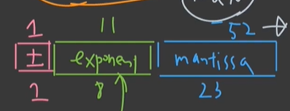
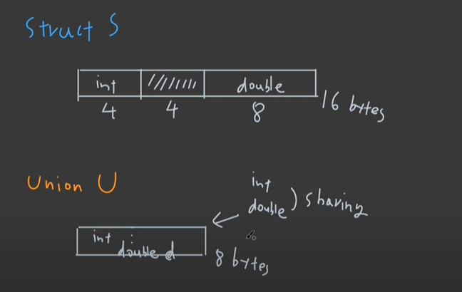

## 부동소수점 Floating number 1


Float(double)은 C++을 포함한 다양한 언어에서 소수를 표현하는데 사용되는 자료형이다.

자율주행, 3D 그래픽, 이미지, 영상처리 분야에 종사하고 싶다면 부동소수점 개념을 꼭 알고있어야 한다.


#### 소수를 이진법으로 어떻게 표현할까?


2진법으로 부동소수점을 표현하는 방법에는 IEEE 754가 널리 쓰이는 standard이다. 소수와 무한, NaN 등의 기호를 표시하는 방법 또한 이에 정의되어 있다.

각 비트를 부호, 지수부(exponent), 가수부(mantissa)로 나눠서 부동소수점을 표현한다.


부동소수점 연산을 할 때 가장 유의해야하는 부분은 아래와 같다.

```c++
#include <iostream>

int main(int argc, char const *argv[])
{
    const float num1 = 0.3f;
    const float num2 = 0.4f;
    
    const float sum = num1 + num2;
    //sum=0.7f이겠지 하지만..
    if (sum == 0.7f)
    {
        std::cout<< "sum is 0.7f" << std::endl;
    }
    else
    {
        std::cout << "sum is not 0.7f" << std::endl;
    }
        return 0;
}


```

위 코드의 결과를 출력해보면 "sum is not 0.7f"이 출력된다. 왜 그럴까? 


## 부동소수점 Floating Number 2


그 이유는 이진법 부동소수점의 한계 때문이다.

예를 들어 `1/3`을 소수로 표현하면 `0.33333 ...` 이므로 정확한 숫자가 아닌 근사값으로 표현해야한다.

그리고 `0.3`을 이진법으로 표현하면 `mantissa * 2^exp`으로 정확하게 표현할 수 없기 때문에 `0.3`에 최대한 가까운 근사값을 이진법으로 표현하게 된다. 다시 말해 오차가 생기게 되는 것이다. 그 근사값은 아래와 같다.


```c++
#include <iostream>
#include <cmath>
#include <limits>
#include <iomanip>

int main()
{

	const float num1 = 0.3f;
	const float num2 = 0.4f;
	const float num3 = 0.7f;

	const float sum = num1 + num2;

	std::cout << std::setprecision(100) << num1 << std::
	endl;
	std::cout << std::setprecision(100) << num2 << std::endl;
	std::cout << std::setprecision(100) << num3 << std::endl;
	std::cout << std::setprecision(100) << sum << std::endl;

	return 0;
}

// num1 = 0.300000011920928955078125
// num2 = 0.4000000059604644775390625
// num3 = 0.699999988079071044921875
// sum = 0.7000000476837158203125
```


위와 같은 결과는 등호 뿐만 아니라 부등호에서도 동일하게 나타날 수 있다. 이를 해결하기 위한 간단한 방법으로는 비교하고자 하는 숫자의 차의 절대값이 어떠한 threshold 보다 작다면 그 둘이 같다라고 정하는 것이다.  이에 대한 자세한 해결법은 [c++ reference의 epsilon](https://en.cppreference.com/w/cpp/types/numeric_limits/epsilon)에 나와있다.

그리고 추가로 이야기하자면, 아래와 같이 `double` 자료형의 경우 mantissa에 할당되는 비트수가 `float`에 비해 더 많기 때문에 조금 더 정밀하게 소수를 표현할 수 있다.




## Union


실무에서 잘 사용되지는 않는 타입이다. union을 사용하는 가장 큰 이유는 memory saving 때문이다. 아래 예제 코드를 살펴보자.

```c++
#include <iostream>

struct S // 4+(4)+8 = 16
{
	int i;	  //4
	double d; //8
};

union U // 8
{
	int i;	  //4
	double d; // 8
};

int main()
{
	std::cout << "size of S: " << sizeof(S) << std::endl;
	std::cout << "size of U: " << sizeof(U) << std::endl;
}

// "size of S: 16"
// "size of U: 18"
```


왜 위와 같은 차이가 발생하냐면, union의 경우 똑같은 공간을 int와 double을 공유하고 있기 때문이다. 한 번에 하나의 타입만 들어가서 사용될 수 있다.





그렇기 때문에 union은 조심히 다루어야 하는 class type이다. c++ 17부터는 이런 위험을 줄이기 위해서 variant라는 것을 도입했는데, 이에 대해서는 추후에 다룰 것이다. 


#### 참고자료

- [위키백과](https://ko.wikipedia.org/wiki/IEEE_754)
- [코드없는프로그래밍](https://www.youtube.com/playlist?list=PLDV-cCQnUlIbMTKI-Tc3RV6i3yn0IWeLT)

