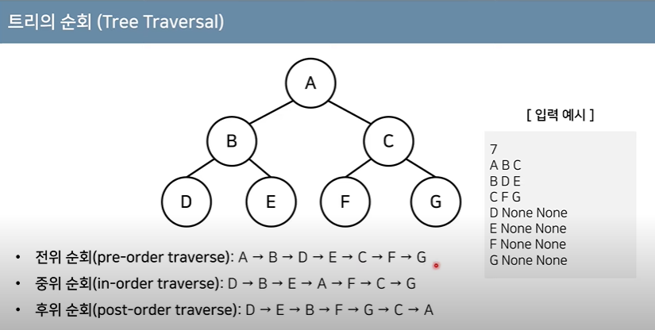

# set

- 종종 사용됨..
- 어떤 꾸러미 안에 데이터를 넣는다라고 생각하면 된다.
- header `set`에 정의되어 있음
- search, removal, insertion이 O(logN)의 시간 복잡도를 가지고 있다.
- red-black trees라는 자료구조를 통해 흔히 구현된다. (항상 그런 것은 아니고 그 라이브러리의 implementation에 따라 다르다)


## 기본적인 사용법

```c++
#include <iostream>
#include <set>

int main(){
    std::set<int> nums{1,2,3,4,5};
    
    return 0;
}
```

- find : O(logN)
- insertion, deletion : O(logN), tree rebuild와 recoloring이 일어남.


## set의 특징

### 중복을 허용하지 않음

```c++
#include <iostream>
#include <set>

int main(){
    std::set<int> nums{1,2,3,4,5};
    
    nums.emplace(3);
    nums.emplace(3);
    nums.emplace(3);
    nums.emplace(3);
    
    for (const int num : nums) {
        std::cout << num << " ";
    }
    std::cout << std::endl; // 3은 한 번만 출력됨. set 안에 이미 3이 있는 것을 확인하면 넣지 않음. 
    
    return 0;
}
```

### 내부적으로 정렬이 되어 있음

- input의 순서와 상관없이 데이터가 정렬되어서 나옴
```c++

#include <iostream>
#include <set>

int main(){
    std::set<int> nums{1,2,3,4,5};
    
    nums.emplace(-1);
    nums.emplace(100);
    nums.emplace(-500);
    nums.emplace(4000);
    nums.emplace(3);
    nums.emplace(6);
    
    for (const int num : nums) {
        std::cout << num << " ";
    }
    std::cout << std::endl; 
    // -500 -1 1 2 3 4 5 6 100 4000 의 순으로 출력
    return 0;
}

```

# tree

- 가계도와 같은 계층적인 구조를 표현할 때 사용할 수 있는 자료구조
- 트리 관련 용어
  - root node : 부모가 없는 최상위 노드
  - leaf node : 자식이 없는 노드
  - size : 트리에 포함된 모든 노드의 개수
  - depth : 루트 노드로부터의 거리
  - height : 깊이 중 최대값
  - degree : 각 노드의 (자식 방향) 간선 개수
- 기본적으로 트리의 크기가 N일 때, 전체 간선의 개수는 N-1 개


## 이진 탐색 트리(Binary Search Tree)

- 이진 탐색이 동작할 수 있도록 고안된 효율적인 탐색이 가능한 자료구조의 일종
- 보통 탐색할 때 O(logN)의 시간 복잡도를 가진다.
- 이진 탐색 트리의 특징 : 왼쪽 자식 노드 < 부모 노드 < 오른쪽 자식 노드
  - 부모 노드보다 왼쪽 자식 노드가 작다(루트 노드에만 해당되는게 아니고 그 밑에 자식 노드들도 동일하게 적용)
  - 부모 노드보다 오른쪽 자식 노드가 크다


## 트리의 순회(tree traversal)

- 트리 자료구조에 포함된 노드를 특정한 방법으로 한 번씩 방문하는 것을 의미
  - 전위 순회(pre-order traverse) : 루트를 먼저 방문
  - 중위 순회(in-order traverse) : 왼쪽 자식을 방문한 뒤에 루트를 방문
  - 후위 순위(post-order traverse) : 오른쪽 자식을 방문한 뒤에 루트를 방문




참고자료 : [코드없는프로그래밍](https://www.youtube.com/watch?v=JONALCRFX4k&list=PLDV-cCQnUlIbbEFNw1ma92aOe-Muya5A3&index=2) [동빈나](https://www.youtube.com/watch?v=i5yHkP1jQmo)

