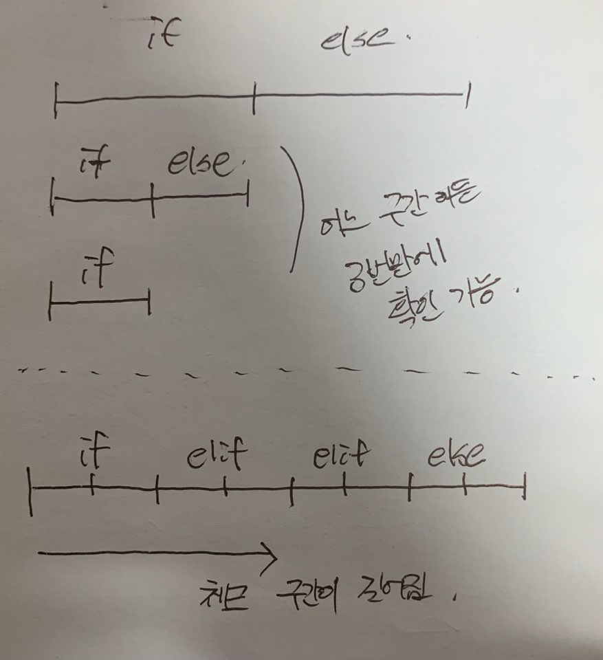

# if문과 시간 복잡도


반복문이 시간 복잡도에 영향을 미친다는 것은 자명하다. 요즘 알고리즘 문제를 풀면서 내 코드를 살펴보니 내가 꽤 if를 많이 활용한다는 것을 알았다. 

전에 포프님이 그랬었나 어디서 봤는지 모르겠는데 전체적인 그림은 그리지 못하고 순간의 에러를 처리하기 위해 방어적으로 if문을 남발하는 것은 스파게티 코드의 근원이라는 말을 들었다. 

그런데 문득 if 문이 연산량이나 시간 복잡도에는 영향을 끼치지 않을까 궁금하여 찾아봤다.


> 결론은 `if문은 시간 복잡도에는 영향을 미치지 않는다` 였다. ([stackoverflow](https://stackoverflow.com/questions/12231499/do-if-statements-affect-in-the-time-complexity-analysis) 참고)


if 문이 많아지면 프로그램의 성능 자체에는 영향을 미칠 수 있다. 하지만 big-O의 개념은 input data의 size인 n에 의해 측정되는 시간의 복잡도를 나타내는 개념이기 때문에 big-O에는 영향을 미치지 않는다. 오히려 이진 탐색의 경우처럼 if 문을 잘 사용하면 연산량을 줄여줄 수도 있다.


# 그렇다면 if 문은 남발해도 되는가?


명령어 파이프라인이나 분기 예측에 대한 개념이 없어서 정확히 이해하지는 못 했다. 내가 이해한 바로는 

```c++
int main() {
    bool test = false;
    if (test) std::cout << "참이에요!" << std::endl;
    else: std::cout << "거짓이에요!" << std::endl;
    
    return 0;
}
```

위의 코드에서 test는 거짓이기 때문에 if문 내부로 들어가는게 아니라 겉핥기만 하고 else로 갈 것으로 생각하는게 일반적인데 실제로는 그렇지 않을 수 있다는 것이었다.


cpu는 파이프라이닝을 통해 실행 속도를 향상시키는데, 다음에 실행될 명령어를 이전 멍령어의 실행이 끝나기 전에 미리 실행시키는 것과 비슷한 개념이다. 

그런데 문제는 분기문이 있을 경우에는 그 다음에 실행될 명령어를 미리 알 수 없다는 것이다. 그래서 cpu는 추세를 보아서 예측에 의해 다음에 실행될 조건문이 어떤 곳으로 분기할 것인지 미리 추측한다. 이를 분기 예측(branch prediction)이라고 한다. 만약 예측이 틀리게 되면 미리 연산하고 기억한 것들을 버리고 올바른 명령을 다시 실행하게 되는데 이게 연산 낭비가 일어날 수 있다는 것이다.


# if 문 잘 사용하기


적절히 사용하는 if 문은 프로그램의 성능을 향상시키고 논리적 에러를 줄일 수 있다. if 문을 잘못 사용하는 대표적인 경우로는 

1. 중복되는 구간을 넣는다. 그래서 이미 앞에서 체크한 것을 또 체크한다.
2. 논리적 허점, 빈 공간이 생기게 if 문을 구사한다. 나중에 예외처리를 다시 하다가 누더기가 될 수도 있고 에러는 안나니까 돌리고나서 이상한 결과물을 받아볼 수도 있다.

등이 있다.


또한 binary breakdown을 사용해서 연산량을 줄일 수도 있다. 




코드로 살펴보면 

```c++
// https://modoocode.com/129 모두의코드 블로그의 코드 

if (i == 1) {
} else if (i == 2) {
} else if (i == 3) {
} else if (i == 4) {
} else if (i == 5) {
} else if (i == 6) {
} else if (i == 7) {
} else if (i == 8) {
} 

// binary breakdown 
if (i <= 4) {
  if (i <= 2) {
    if (i == 1) {
      /* i is 1 */
    } else {
      /* i must be 2 */
    }
  } else {
    if (i == 3) {
      /* i is 3 */
    } else {
      /* i must be 4 */
    }
  }
} else {
  if (i <= 6) {
    if (i == 5) {
      /* i is 5 */
    } else {
      /* i must be 6 */
    }
  } else {
    if (i == 7) {
      /* i is 7 */
    } else {
      /* i must be 8 */
    }
  }
}
```


이런 식으로 구간을 나눠서 찾아보면 연산을 줄일 수도 있다.


# 결론


1. if 문은 시간 복잡도에는 영향을 미치지 않는다.
2. 하지만 남발하다가 분기 예측 실패를 야기하여 프로그램 성능에 영향을 미칠 수 있다.
3. 설렁설렁 공부하다 넘어갔던 명령어 파이프라인, 분기 예측 등을 다시 공부하자 꼭 ...  운영체제와 컴퓨터 구조를 소홀히하지 말 것.