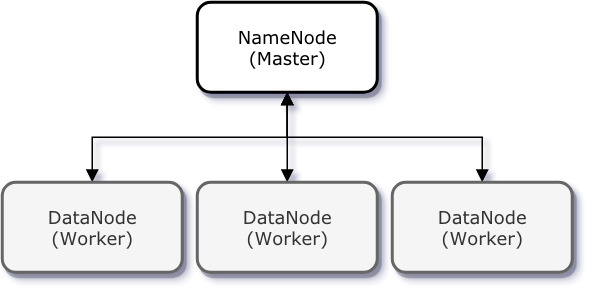
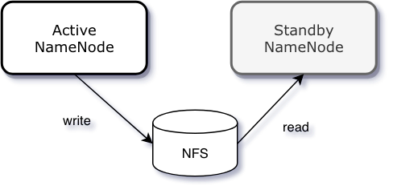
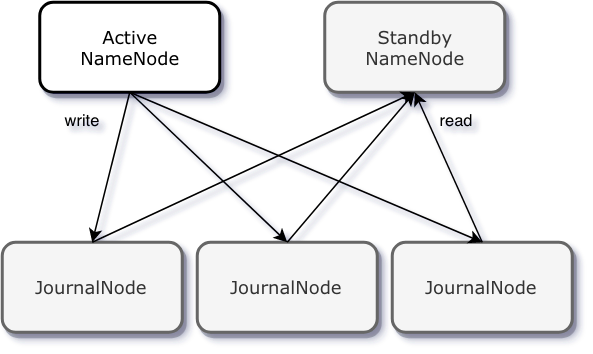
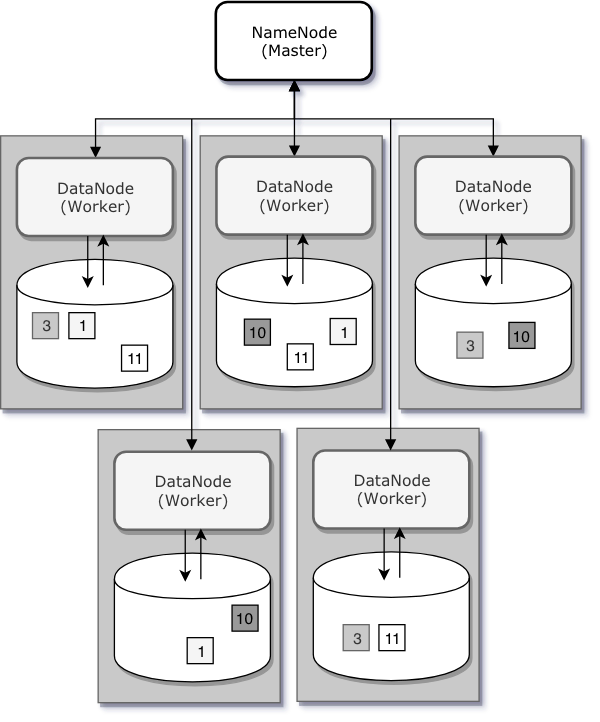

# 하둡 클러스터 구조

하둡 클러스터는 단일의 마스터 노드인 NameNode와 여러 대의 워커 노드인 DataNode로 이루어진 Master/Slave 구조이다. 네임노드는 하둡 분산 파일 시스템(HDFS)의 네임스페이스를 관리하고, 데이터노드는 파일 시스템의 파일 블록을 저장한다. 

## 네임노드

네임노드가 네임스페이스를 관리한다는 것은 파일 시스템 트리와 트리 안의 모든 파일 및 디렉토리에 대한 메타 정보를 관리한다는 뜻으로, 이는 리눅스 파일시스템의 inode와 유사하다고 볼 수 있다. 네임노드는 파일이 어느 노드에 위치한 블록으로 구성되어 있는지 알고 있으며, 모든 변경사항을 기록한다.

파일 변경 사항은 `EditLog`, `FsImage` 두 가지 파일에 의해 관리 된다. HDFS의 모든 변경 사항에 대한 트랜잭션 로그 정보가 EditLog에 기록되고, HDFS의 전체 이미지 정보는 FsImage에 저장되고, 이 파일들은 클러스터 장애로 인해 NameNode를 재시작할 때 파일 시스템의 네임스페이스와 메타 정보를 복구하는데 사용된다. 네임노드가 재시작되면 네임스페이스를 복구하기 위해 FsImage를 먼저 읽어들인 후 EditLog의 내용을 차례로 병합하여 기동한다. 따라서 EditLog 수가 늘어날수록 기동 시간은 늘어나게 된다.

### Secondary NameNode

네임노드 장애시 데이터 복구를 위한 노드이다.디스크 장애가 발생한다면 로컬 파일 시스템에 저장되어있는 EditLog와 FsImage가 유실될 수 있는데 이런 문제를 방지하기 위해 백업 노드를 만들어놓는데 이것이 `Secondary NameNode`이다. 

### Standby NameNode

 네임노드가 어떠한 이유에 의해 다운되게 되면 즉시 HDFS를 사용할 수 없는 상태가 되고 이는 가용성 측면에서 바람직하지 않다. 그래서 Hadoop 2에서는 HA구성을 활성화하여 Active/Standby 상태를 갖는 두 개의 네임노드를 구성할 수 있다. 두 네임노드는 FsImage와 EditLog저장을 위한 NFS와 같은 공유 저장소를 갖는다. 공유 저장소를 통해 두 네임노드는 동기화된다. 만약 Active 네임노드에 장애가 발생한다면 바로 Standby 상태의 노드를 활성화시킴으로써 `단일 지점 실패(SPOF)`문제를 막을 수 있다. 

### Journal Node

NFS와 같은 공유 저장소를 두었을 때의 문제는 NFS 자체가 장애가 생겼을 때이다. 공유 저장소가 이중화 되어있지 않으면 이 저장소가 SPOF가 될 수 있고, 이는 클러스터의 장애로 이어질 수 있다.

이 문제를 해결하기 위해 단일 공유 저장소 대신 네임노드에 JournalManager라는 것을 두고 JournalNode로 이루어진 분산 저장소에 FsImage와 EditLog를 저장하고 동기화하여 가용성을 확보하였다.

출처 : https://blog.geunho.dev/posts/hadoop-namenode/#standby-namenode

## 데이터 노드

하둡 클러스터에서 DataNode는 파일 블록이 저장되는 노드이다. 수천대의 서버에서 데이터노드가 가동되어 네트워크 상에서 거대한 파일 시스템의 블록 구조를 가지게 된다. 데이터노드에 저장되는 블록의 크기는 64MB~128MB의 크기를 가진다. 이는 HDFS가 저장하고 처리하고자 하는 파일 하나의 크기가 작게는 수백 메가바이트에서 크게는 테라, 페타 바이트 만큼 크기 때문이다. 일반적인 파일시스템은 디스크 블록보다 작은 크기의 데이터라도 블록 1개 전체를 점유하지만, HDFS에서는 블록 크기보다 작은 파일이 전체 블록 크기만큼의 공간을 차지하지 않는다. 하지만 작은 파일들이 많아지게 되면 메타데이터가 더 많이 생성되어야할 거시고, 네임노드는 파일 시스템의 메타데이터를 전부 메모리에 관리하기 때문에 블록 크기 보다 작은 많은 수의 파일을 HDFS에 저장하는 것은 네임노드에 부담을 준다. 고로 HDFS에 적합하지 않다. 

네임노드와 마찬가지로 데이터노드도 분산 환경에서 파일 블록의 유실을 방지하는 장치를 마련하였는데 분산된 노드에 파일 블록의 복제본을 두고 있다. HDFS에서는 기본적으로 세 개의 파일 블록 복제본을 서로 다른 데이터노드에 보관하도록 처리한다. 하나의 데이터노드의 데이터가 모두 유실되더라도 다른 데이터노드에 저장된 복제본 블록에 접근해서 온전한 파일을 읽을 수 있다. 

출처 : https://blog.geunho.dev/posts/hadoop-datanode/
